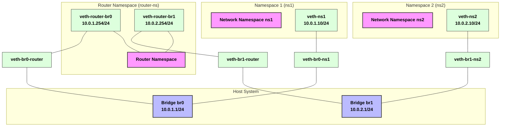

# Network-Namespace-Simulation

Here's the complete README file code for you to copy and paste directly into your GitHub README.md file:

# Linux Network Namespace Simulation

A bash script for creating and managing multiple network namespaces connected via bridges and a router namespace.

## Overview

This project simulates two separate networks connected through a router using Linux network namespaces and bridges. It creates an isolated networking environment on a single Linux host.

## Network Topology

## Features

- Creates two isolated network namespaces (ns1, ns2)
- Sets up a router namespace to connect both networks
- Configures bridges (br0, br1) for network connectivity
- Implements proper IP addressing and routing
- Provides commands for testing connectivity
- Includes cleanup functionality

## Requirements

- Linux system with network namespace support
- Root privileges
- Basic bash environment

## IP Addressing

- **Network 1 (10.0.1.0/24)**
  - Bridge (br0): 10.0.1.1/24
  - Namespace 1 (ns1): 10.0.1.10/24
  - Router interface: 10.0.1.254/24

- **Network 2 (10.0.2.0/24)**
  - Bridge (br1): 10.0.2.1/24
  - Namespace 2 (ns2): 10.0.2.10/24
  - Router interface: 10.0.2.254/24

## Technical Details

The script creates:
- 3 network namespaces (ns1, ns2, router-ns)
- 2 network bridges (br0, br1)
- 4 virtual ethernet pairs to connect everything
- Proper routing configuration for cross-network communication
